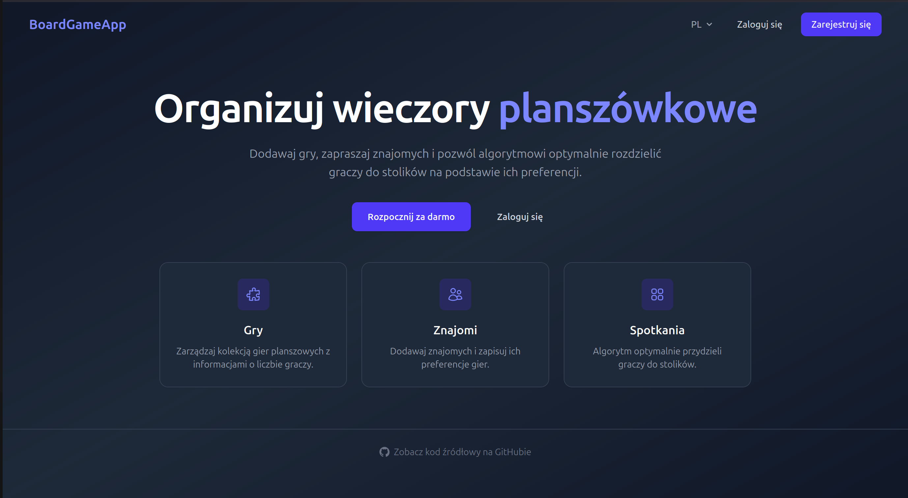
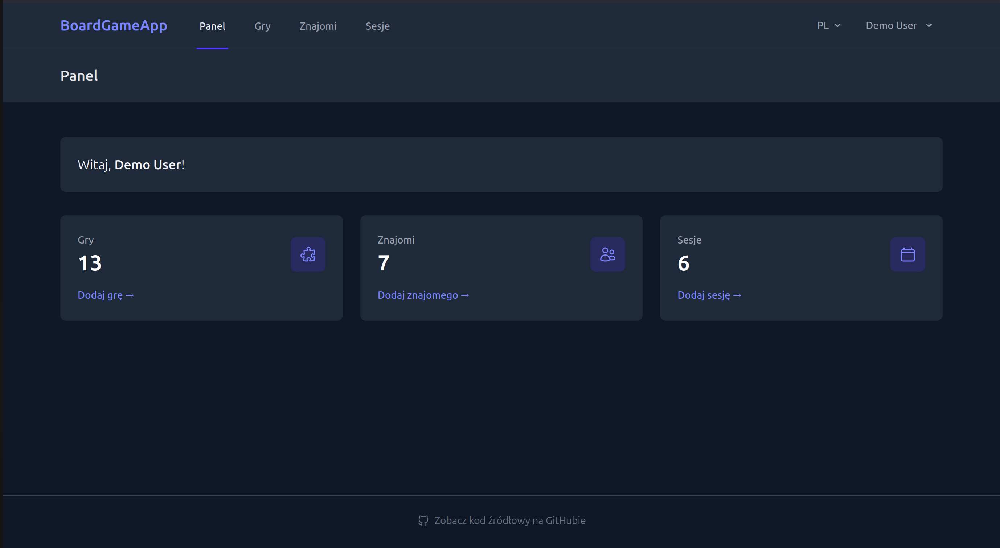
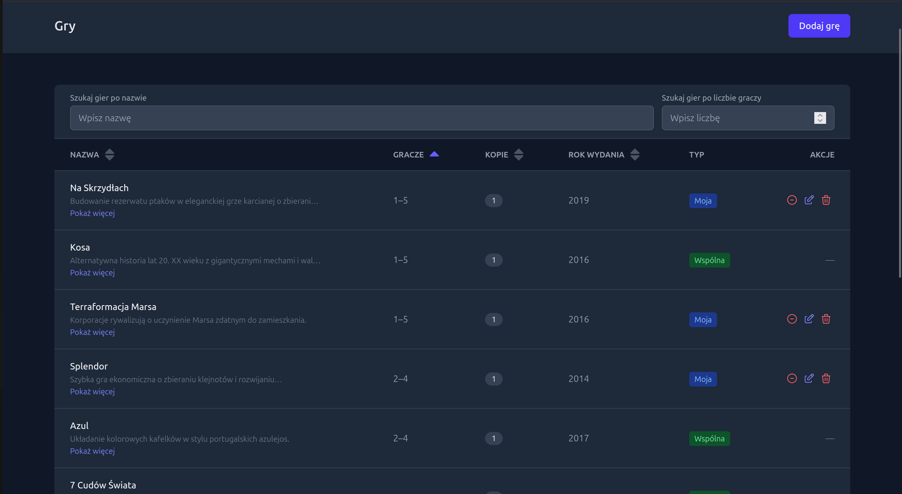
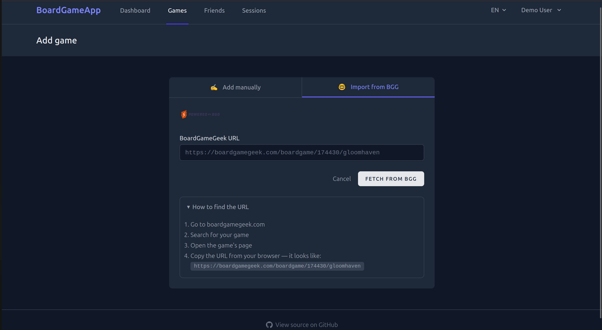
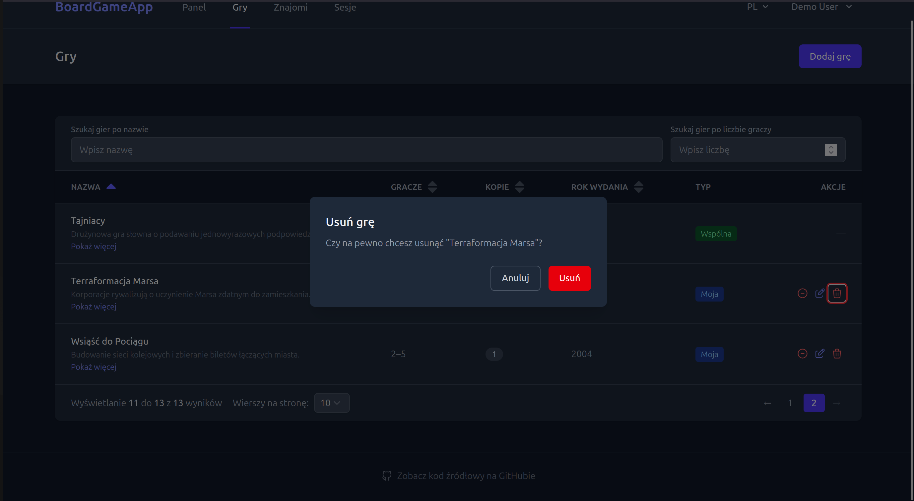
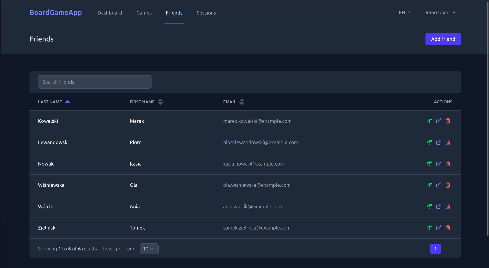
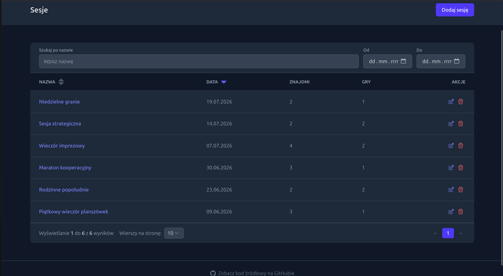

## @blumilksoftware/boardgameapp
## About

Big friend groups play games together, but everyone likes different things.
This app tracks which games each person enjoys and how much, then uses that
data to sort people into game tables playing something they actually want to play.

### Live demo

**[boardgamesapp-production.up.railway.app](https://boardgamesapp-production.up.railway.app)**

Log in with a read/write demo account — no registration needed:

- Email: `demo@boardgameapp.dev`
- Password: `DemoPass123!`

The demo account is pre-loaded with a sample collection: 12 games, 6 friends with rated
preferences, and 6 past game sessions.

### Screenshots

**Landing page**


**Dashboard**


**Game collection**


**Adding a game (BoardGameGeek import)**


**Delete confirmation**


**Friends & preferences**


**Game sessions**


### Features

- Track a personal or shared board game collection, with player counts, copies owned and descriptions
- Import a game straight from a BoardGameGeek URL instead of entering details by hand
- Keep a friends list and record each friend's rating (1–10) for every game
- Log game sessions and automatically seat friends at tables based on their game preferences
- English and Polish, switchable at any time
- Light and dark themes

### Local development
```
cp .env.example .env
task init
task vite
```
Application will be running under [localhost:63851](localhost:63851) and [http://boardgameapp.blumilk.localhost/](http://boardgameapp.blumilk.localhost/) in Blumilk traefik environment. If you don't have a Blumilk traefik environment set up yet, follow the instructions from this [repository](https://github.com/blumilksoftware/environment).

#### After initialization
```
task run
task vite
```
You also have to set up https://github.com/blumilksoftware/environment in another directory and run it.

#### After initialization (offline)
```
task run-offline
task vite
```
#### Commands
Before running any of the commands below, you must run shell:
```
task shell
```
| Command                 | Task                                        |
|:------------------------|:--------------------------------------------|
| `composer <command>`    | Composer                                    |
| `composer test`         | Runs backend tests                          |
| `composer analyse`      | Runs Larastan analyse for backend files     |
| `composer cs`           | Lints backend files                         |
| `composer csf`          | Lints and fixes backend files               |
| `php artisan <command>` | Artisan commands                            |
| `npm run dev`           | Compiles and hot-reloads for development    |
| `npm run build`         | Compiles and minifies for production        |
| `npm run lint`          | Lints frontend files                        |
| `npm run lintf`         | Lints and fixes frontend files              |
| `npm run tsc`           | Runs TypeScript checker                     |


#### Containers

| service    | container name             | default host port               |
|:-----------|:---------------------------|:--------------------------------|
| `app`      | `boardgameapp-app-dev`     | [63851](http://localhost:63851) |
| `database` | `boardgameapp-db-dev`      | 63853                           |
| `redis`    | `boardgameapp-redis-dev`   | 63852                           |
| `mailpit`  | `boardgameapp-mailpit-dev` | 63854                           |
